# ClipCordon

ClipCordon is an AI x Web3 hackathon prototype for AI payments. The D1 skeleton runs a minimal loop: a local agent creates one signal, asks an OpenAI-compatible LLM for a decision, calls a local `/paid-mock` endpoint, prints placeholder x402 and receipt output, and sends a console notification.

## Idea Flow Sketch

ClipCordon is evolving toward a **LiveClip Rights Agent**: an AI agent for livestream commerce clipping studios that checks whether each shoppable clip can be published across TikTok, Reels, and Shorts, then automatically buys missing commercial-use assets through x402 and records the license evidence onchain.

```mermaid
---
config:
  look: handDrawn
  theme: neutral
---
flowchart LR
  U["Clipping Studio<br/>Input: running-shoe livestream + target platforms<br/>TikTok / Reels / Shorts"] --> A["LiveClip Rights Agent"]

  A --> P["Perception Layer<br/>Read brief, livestream clips, product info<br/>target platforms, existing asset licenses"]

  P --> D{"Can each clip<br/>be used commercially<br/>across platforms?"}

  D -- "License is enough" --> M["Generate Clip Rights Manifest<br/>KOL authorization + product link + asset sources"]

  D -- "License is missing" --> S["Select Supplier Agent<br/>BGM / SFX / caption template / voice hook"]

  S --> R["ERC-8004<br/>Check supplier_agent_id<br/>reputation, validation history, license type"]

  R --> X["AgentKit onchain execution<br/>x402 USDC payment<br/>Base Sepolia"]

  X --> B["Supplier Agent returns<br/>license_receipt_hash<br/>asset file hash<br/>license scope"]

  B --> C["Clip402 Rights Registry<br/>write registry event"]

  C --> M

  M --> O["Output<br/>3 publishable shoppable clips<br/>each with a rights manifest"]
  M --> E["Explorer evidence<br/>USDC payment TX<br/>Registry event TX"]

  O --> J["Demo magic moment<br/>Agent detects clip 2's BGM is TikTok-only<br/>then pays for cross-platform rights and creates a verifiable manifest"]
```



## Structure

```text
hackcamp-w2-ClipCordon
├── agent/       # Independent Node + TypeScript + tsx package
├── web/         # Independent Next.js App Router package
├── contracts/   # Remix-only Solidity contract
├── .cursorrules
├── .gitignore
└── README.md
```

This is not a monorepo and does not use pnpm workspaces. Install and run each package separately.

## Agent

```bash
cd agent
npm install
cp .env.example .env
npm run dev
```

By default, the LLM client uses DeepSeek-compatible OpenAI settings:

- `LLM_BASE_URL=https://api.deepseek.com`
- `LLM_MODEL=deepseek-chat`
- `LLM_API_KEY=` must be set for a real LLM call

If `LLM_API_KEY` is empty, the agent logs a placeholder decision so the local demo still runs.

## Web

```bash
cd web
npm install
npm run dev
```

Open `http://localhost:3000` for the landing page and `/dashboard` for the receipt dashboard. D1 shows one hardcoded placeholder record. Later, set these Vercel env vars after deploying `PaymentReceipt.sol`:

- `NEXT_PUBLIC_RPC_URL`
- `NEXT_PUBLIC_PAYMENT_RECEIPT_ADDRESS`

The dashboard uses viem `getLogs` with `createPublicClient` and `http()` to read receipt events when those values are present.

## Contract

`contracts/PaymentReceipt.sol` is intended for D2 Remix deployment. It emits `ReceiptIssued` for each payment decision and is not wired into a local build chain.

## External Calls

All HTTP, RPC, and LLM calls are wrapped with one retry. If both attempts fail, the current round logs a warning and skips instead of crashing the process.

## Polymarket Note

For future market-data integrations, use Polymarket CLOB V2 at `https://clob.polymarket.com`. Legacy V1 SDKs and V1-signed orders are no longer the production target.
