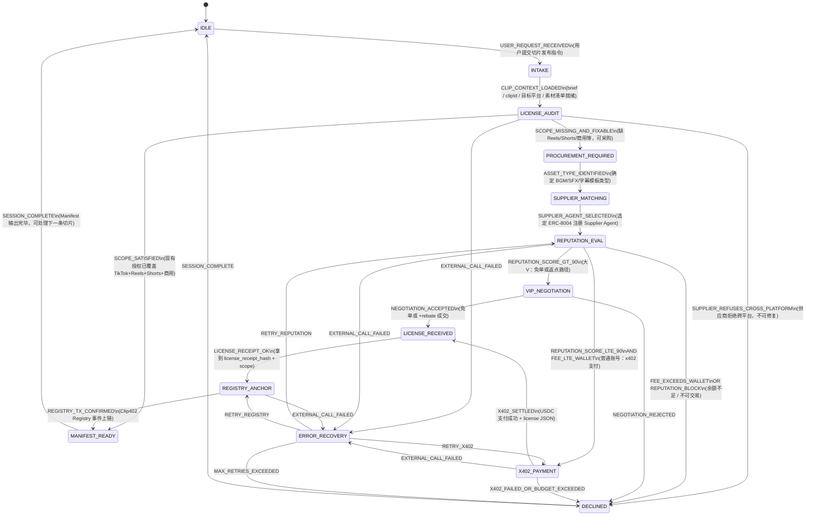

# LiveClip Rights Agent — State Machine

ClipCordon 主 Agent 场景（见 [README](../README.md)）：读取直播 brief 与切片授权状态 → 判断能否跨 TikTok / Reels / Shorts 商用 → 必要时通过 ERC-8004 声誉定价 → x402 支付或 VIP 谈判 → 链上 Registry 留痕 → 输出 Clip Rights Manifest。

---

## State Diagram



### Demo magic moment mapping

| Demo | Path |
|------|------|
| Clip_002 / `0xNewbie`，BGM 仅 TikTok | `… → REPUTATION_EVAL → X402_PAYMENT → …` |
| Clip_003 / `0xVipKOL`，声誉 > 90 | `… → REPUTATION_EVAL → VIP_NEGOTIATION → …` |
| 授权已齐全 | `LICENSE_AUDIT → MANIFEST_READY`（跳过采购） |

---

## States (UPPER_SNAKE)

| State | Purpose |
|-------|---------|
| `IDLE` | 无活跃切片会话，等待用户指令 |
| `INTAKE` | 解析用户 brief、clipId、目标平台、素材与钱包 |
| `LICENSE_AUDIT` | 对比 `currentScope` vs `requiredScope` |
| `PROCUREMENT_REQUIRED` | 确认缺失授权，准备采购 |
| `SUPPLIER_MATCHING` | 选择 BGM/SFX/字幕 Supplier Agent |
| `REPUTATION_EVAL` | ERC-8004 声誉查询与定价分支 |
| `X402_PAYMENT` | 普通声誉路径：x402 USDC 微支付 |
| `VIP_NEGOTIATION` | 高声誉路径：免单或返点谈判 |
| `LICENSE_RECEIVED` | Supplier 返回 license receipt 与 scope |
| `REGISTRY_ANCHOR` | 写入 Clip402 Rights Registry + decision receipt |
| `MANIFEST_READY` | 生成 Clip Rights Manifest，会话成功结束 |
| `DECLINED` | 合规拒绝或支付失败，会话结束 |
| `ERROR_RECOVERY` | 外部调用失败后重试或放弃 |

---

## TypeScript Template

```typescript
/** LiveClip Rights Agent — clip-level state machine */
export enum AgentState {
  IDLE = "IDLE",
  INTAKE = "INTAKE",
  LICENSE_AUDIT = "LICENSE_AUDIT",
  PROCUREMENT_REQUIRED = "PROCUREMENT_REQUIRED",
  SUPPLIER_MATCHING = "SUPPLIER_MATCHING",
  REPUTATION_EVAL = "REPUTATION_EVAL",
  X402_PAYMENT = "X402_PAYMENT",
  VIP_NEGOTIATION = "VIP_NEGOTIATION",
  LICENSE_RECEIVED = "LICENSE_RECEIVED",
  REGISTRY_ANCHOR = "REGISTRY_ANCHOR",
  MANIFEST_READY = "MANIFEST_READY",
  DECLINED = "DECLINED",
  ERROR_RECOVERY = "ERROR_RECOVERY",
}

export enum AgentEvent {
  USER_REQUEST_RECEIVED = "USER_REQUEST_RECEIVED",
  CLIP_CONTEXT_LOADED = "CLIP_CONTEXT_LOADED",
  SCOPE_SATISFIED = "SCOPE_SATISFIED",
  SCOPE_MISSING_AND_FIXABLE = "SCOPE_MISSING_AND_FIXABLE",
  SUPPLIER_REFUSES_CROSS_PLATFORM = "SUPPLIER_REFUSES_CROSS_PLATFORM",
  ASSET_TYPE_IDENTIFIED = "ASSET_TYPE_IDENTIFIED",
  SUPPLIER_AGENT_SELECTED = "SUPPLIER_AGENT_SELECTED",
  REPUTATION_SCORE_GT_90 = "REPUTATION_SCORE_GT_90",
  REPUTATION_SCORE_LTE_90 = "REPUTATION_SCORE_LTE_90",
  FEE_EXCEEDS_WALLET = "FEE_EXCEEDS_WALLET",
  REPUTATION_BLOCK = "REPUTATION_BLOCK",
  NEGOTIATION_ACCEPTED = "NEGOTIATION_ACCEPTED",
  NEGOTIATION_REJECTED = "NEGOTIATION_REJECTED",
  X402_SETTLED = "X402_SETTLED",
  X402_FAILED_OR_BUDGET_EXCEEDED = "X402_FAILED_OR_BUDGET_EXCEEDED",
  LICENSE_RECEIPT_OK = "LICENSE_RECEIPT_OK",
  REGISTRY_TX_CONFIRMED = "REGISTRY_TX_CONFIRMED",
  SESSION_COMPLETE = "SESSION_COMPLETE",
  EXTERNAL_CALL_FAILED = "EXTERNAL_CALL_FAILED",
  RETRY_REPUTATION = "RETRY_REPUTATION",
  RETRY_X402 = "RETRY_X402",
  RETRY_REGISTRY = "RETRY_REGISTRY",
  MAX_RETRIES_EXCEEDED = "MAX_RETRIES_EXCEEDED",
}

export type AgentContext = {
  clipId: string;
  targetPlatforms: string[];
  materialLicense: {
    currentScope: string[];
    supplierRefusesCrossPlatform: boolean;
  };
  requiredLicenseScope: string[];
  walletBalanceUsd: number;
  x402LicenseFeeUsd: number;
  reputationScore: number | null;
  supplierAgentId: string | null;
  retryCount: number;
  maxRetries: number;
};

export type TransitionResult =
  | { ok: true; nextState: AgentState; context: AgentContext }
  | { ok: false; reason: string; state: AgentState };

const TRANSITIONS: Record<AgentState, Partial<Record<AgentEvent, AgentState>>> = {
  [AgentState.IDLE]: {
    [AgentEvent.USER_REQUEST_RECEIVED]: AgentState.INTAKE,
  },
  [AgentState.INTAKE]: {
    [AgentEvent.CLIP_CONTEXT_LOADED]: AgentState.LICENSE_AUDIT,
  },
  [AgentState.LICENSE_AUDIT]: {
    [AgentEvent.SCOPE_SATISFIED]: AgentState.MANIFEST_READY,
    [AgentEvent.SCOPE_MISSING_AND_FIXABLE]: AgentState.PROCUREMENT_REQUIRED,
    [AgentEvent.SUPPLIER_REFUSES_CROSS_PLATFORM]: AgentState.DECLINED,
    [AgentEvent.EXTERNAL_CALL_FAILED]: AgentState.ERROR_RECOVERY,
  },
  [AgentState.PROCUREMENT_REQUIRED]: {
    [AgentEvent.ASSET_TYPE_IDENTIFIED]: AgentState.SUPPLIER_MATCHING,
  },
  [AgentState.SUPPLIER_MATCHING]: {
    [AgentEvent.SUPPLIER_AGENT_SELECTED]: AgentState.REPUTATION_EVAL,
  },
  [AgentState.REPUTATION_EVAL]: {
    [AgentEvent.REPUTATION_SCORE_GT_90]: AgentState.VIP_NEGOTIATION,
    [AgentEvent.REPUTATION_SCORE_LTE_90]: AgentState.X402_PAYMENT,
    [AgentEvent.FEE_EXCEEDS_WALLET]: AgentState.DECLINED,
    [AgentEvent.REPUTATION_BLOCK]: AgentState.DECLINED,
    [AgentEvent.EXTERNAL_CALL_FAILED]: AgentState.ERROR_RECOVERY,
  },
  [AgentState.VIP_NEGOTIATION]: {
    [AgentEvent.NEGOTIATION_ACCEPTED]: AgentState.LICENSE_RECEIVED,
    [AgentEvent.NEGOTIATION_REJECTED]: AgentState.DECLINED,
  },
  [AgentState.X402_PAYMENT]: {
    [AgentEvent.X402_SETTLED]: AgentState.LICENSE_RECEIVED,
    [AgentEvent.X402_FAILED_OR_BUDGET_EXCEEDED]: AgentState.DECLINED,
    [AgentEvent.EXTERNAL_CALL_FAILED]: AgentState.ERROR_RECOVERY,
  },
  [AgentState.LICENSE_RECEIVED]: {
    [AgentEvent.LICENSE_RECEIPT_OK]: AgentState.REGISTRY_ANCHOR,
  },
  [AgentState.REGISTRY_ANCHOR]: {
    [AgentEvent.REGISTRY_TX_CONFIRMED]: AgentState.MANIFEST_READY,
    [AgentEvent.EXTERNAL_CALL_FAILED]: AgentState.ERROR_RECOVERY,
  },
  [AgentState.MANIFEST_READY]: {
    [AgentEvent.SESSION_COMPLETE]: AgentState.IDLE,
  },
  [AgentState.DECLINED]: {
    [AgentEvent.SESSION_COMPLETE]: AgentState.IDLE,
  },
  [AgentState.ERROR_RECOVERY]: {
    [AgentEvent.RETRY_REPUTATION]: AgentState.REPUTATION_EVAL,
    [AgentEvent.RETRY_X402]: AgentState.X402_PAYMENT,
    [AgentEvent.RETRY_REGISTRY]: AgentState.REGISTRY_ANCHOR,
    [AgentEvent.MAX_RETRIES_EXCEEDED]: AgentState.DECLINED,
  },
};

/** Derive the event to emit from business context (orchestrator helper). */
export function deriveEvent(state: AgentState, ctx: AgentContext): AgentEvent | null {
  switch (state) {
    case AgentState.LICENSE_AUDIT: {
      const missing = ctx.requiredLicenseScope.filter((s) => !ctx.materialLicense.currentScope.includes(s));
      if (ctx.materialLicense.supplierRefusesCrossPlatform && missing.length > 0) {
        return AgentEvent.SUPPLIER_REFUSES_CROSS_PLATFORM;
      }
      if (missing.length === 0) return AgentEvent.SCOPE_SATISFIED;
      return AgentEvent.SCOPE_MISSING_AND_FIXABLE;
    }
    case AgentState.REPUTATION_EVAL: {
      if (ctx.reputationScore === null) return null;
      if (ctx.x402LicenseFeeUsd > ctx.walletBalanceUsd) return AgentEvent.FEE_EXCEEDS_WALLET;
      if (ctx.reputationScore > 90) return AgentEvent.REPUTATION_SCORE_GT_90;
      return AgentEvent.REPUTATION_SCORE_LTE_90;
    }
    default:
      return null;
  }
}

export function transition(
  state: AgentState,
  event: AgentEvent,
  context: AgentContext,
): TransitionResult {
  const next = TRANSITIONS[state]?.[event];
  if (!next) {
    return { ok: false, reason: `Invalid transition: ${state} + ${event}`, state };
  }
  return { ok: true, nextState: next, context };
}
```

---

## LLM Tool Subsets by State

**Rule:** LLM may only call tools whitelisted for the current state. State changes are emitted by the orchestrator from handler results (`AgentEvent`), not by the LLM directly.

| State | Allowed tools | Notes |
|-------|---------------|-------|
| `IDLE` | _(none)_ | Wait for user input |
| `INTAKE` | `parse_clip_request` | Parse clipId, platforms, BGM/SFX, creator wallet |
| `LICENSE_AUDIT` | `audit_license_scope`, `decline` | Compare scopes; decline if unfixable |
| `PROCUREMENT_REQUIRED` | `identify_missing_assets` | List missing asset types |
| `SUPPLIER_MATCHING` | `select_supplier_agent` | Pick ERC-8004 Supplier Agent |
| `REPUTATION_EVAL` | `check_erc8004_reputation`, `decline` | Query reputation; decline if blocked |
| `X402_PAYMENT` | `pay_for_service`, `decline` | Normal reputation; x402 USDC pay |
| `VIP_NEGOTIATION` | `negotiate_free_license`, `decline` | Reputation > 90; free license or rebate |
| `LICENSE_RECEIVED` | _(none)_ | Deterministic wait for supplier receipt |
| `REGISTRY_ANCHOR` | `anchor_registry` | Write Clip402 Registry + `issue_receipt` |
| `MANIFEST_READY` | `generate_manifest` | Output Clip Rights Manifest |
| `DECLINED` | `issue_receipt` | On-chain memo only: `decline\|reason` |
| `ERROR_RECOVERY` | `retry_step`, `decline` | Retry or give up |

```typescript
export type AgentTool =
  | "parse_clip_request"
  | "audit_license_scope"
  | "identify_missing_assets"
  | "select_supplier_agent"
  | "check_erc8004_reputation"
  | "pay_for_service"
  | "negotiate_free_license"
  | "anchor_registry"
  | "generate_manifest"
  | "decline"
  | "issue_receipt"
  | "retry_step";

export const TOOLS_BY_STATE: Record<AgentState, readonly AgentTool[]> = {
  [AgentState.IDLE]: [],
  [AgentState.INTAKE]: ["parse_clip_request"],
  [AgentState.LICENSE_AUDIT]: ["audit_license_scope", "decline"],
  [AgentState.PROCUREMENT_REQUIRED]: ["identify_missing_assets"],
  [AgentState.SUPPLIER_MATCHING]: ["select_supplier_agent"],
  [AgentState.REPUTATION_EVAL]: ["check_erc8004_reputation", "decline"],
  [AgentState.X402_PAYMENT]: ["pay_for_service", "decline"],
  [AgentState.VIP_NEGOTIATION]: ["negotiate_free_license", "decline"],
  [AgentState.LICENSE_RECEIVED]: [],
  [AgentState.REGISTRY_ANCHOR]: ["anchor_registry"],
  [AgentState.MANIFEST_READY]: ["generate_manifest"],
  [AgentState.DECLINED]: ["issue_receipt"],
  [AgentState.ERROR_RECOVERY]: ["retry_step", "decline"],
};

export function toolsForState(state: AgentState): readonly AgentTool[] {
  return TOOLS_BY_STATE[state];
}
```

### Mapping to existing code

| Existing tool / handler | State |
|-------------------------|-------|
| `check_erc8004_reputation` | `REPUTATION_EVAL` |
| `pay_for_service` | `X402_PAYMENT` |
| `negotiate_free_license` | `VIP_NEGOTIATION` |
| `decline` | `LICENSE_AUDIT`, `REPUTATION_EVAL`, `X402_PAYMENT`, `VIP_NEGOTIATION` |
| `issueReceipt()` in `agent/src/llm.ts` | After every `decide()` round (non-LLM side effect) |
| Worker `trigger_alert` / `record_only` | Separate price-monitoring loop; not on this main path |

---

## Orchestrator sketch

```typescript
async function runClipSession(initialCtx: AgentContext): Promise<AgentState> {
  let state = AgentState.IDLE;
  let ctx = initialCtx;

  state = transition(state, AgentEvent.USER_REQUEST_RECEIVED, ctx).nextState!;
  state = transition(state, AgentEvent.CLIP_CONTEXT_LOADED, ctx).nextState!;

  while (state !== AgentState.IDLE) {
    const allowedTools = toolsForState(state);
    const autoEvent = deriveEvent(state, ctx);

    if (autoEvent && state === AgentState.LICENSE_AUDIT) {
      const tr = transition(state, autoEvent, ctx);
      if (tr.ok) {
        state = tr.nextState;
        continue;
      }
    }

    const result = await decide({
      scenario: `liveclip_${state.toLowerCase()}`,
      userPrompt: buildStatePrompt(state, ctx),
      tools: allTools.filter((t) => allowedTools.includes(t.name as AgentTool)),
      handlers: handlersForState(state),
      // ...
    });

    const event = mapToolResultToEvent(state, result);
    const tr = transition(state, event, ctx);
    if (!tr.ok) break;
    state = tr.nextState;
    ctx = tr.context;
  }

  return state;
}
```

Each state exposes only its tool subset; `decide()` advances one state per LLM round.
